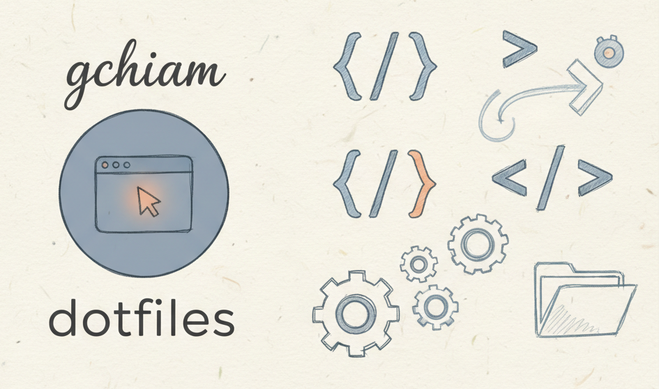

# 🔧 My dotfiles



Personal macOS development environment configuration files managed with GNU
Stow.

[](https://github.com/gchiam/gchiam-dotfiles)
[](https://www.gnu.org/software/stow/)
[](https://github.com/zsh-users/zsh)

## ⚡ Quick Setup

```bash
# Clone the repository
git clone https://github.com/gchiam/gchiam-dotfiles.git ~/.dotfiles
cd ~/.dotfiles

# Run the main setup script
./bin/setup.sh
```

## 📦 What's Included

🐚 **Shell**: [Zsh](https://github.com/zsh-users/zsh) with
[antidote](https://github.com/mattmc3/antidote) plugin manager

📝 **Editor**: [Neovim](https://github.com/neovim/neovim)
([LazyVim](https://github.com/LazyVim/LazyVim) distribution)

💻 **Terminals**: [Alacritty](https://github.com/alacritty/alacritty),
[Kitty](https://github.com/kovidgoyal/kitty),
[WezTerm](https://github.com/wez/wezterm)

🪟 **Window Management**: [AeroSpace](https://github.com/nikitabobko/AeroSpace)
tiling window manager

📦 **Package Management**: [Homebrew](https://github.com/Homebrew/brew) with
curated package lists

🌳 **Git**: Enhanced with [delta](https://github.com/dandavison/delta) for
better diffs

🎨 **Theming**: Consistent
[Catppuccin](https://github.com/catppuccin/catppuccin) across all tools

## ✨ Key Features

🏗️ **Modular Architecture** - Each tool has its own configuration
directory

🔗 **Stow-based Management** - Clean symlink organization with
[GNU Stow](https://github.com/aspiers/stow)

🍎 **macOS Optimized** - Tailored for Apple Silicon Macs

💼 **Work Integration** - Separate configurations for professional tools

## 🛠️ Installation Options

### 🎯 Interactive Setup (Recommended)

```bash
# Interactive setup with backup and selective installation
./bin/setup-interactive.sh

# Quick installation profiles
./bin/setup-interactive.sh --minimal     # Essential tools only
./bin/setup-interactive.sh --developer   # Development-focused setup
./bin/setup-interactive.sh --full        # Complete installation
```

### ⚙️ Manual Installation

For selective installation of specific configurations:

```bash
# Install all configurations with stow
./bin/setup-stow.sh

# Install specific tool configurations
stow -d stow -t ~ nvim    # Neovim config
stow -d stow -t ~ zsh     # Zsh config
stow -d stow -t ~ git     # Git config
```

## 🎭 Environment Profiles

Manage different configurations for work, personal, or minimal setups:

```bash
# List available profiles
./bin/setup-profile.sh list

# Apply a profile interactively
./bin/setup-profile.sh interactive

# Apply specific profile
./bin/setup-profile.sh apply work      # Work environment
./bin/setup-profile.sh apply personal  # Personal setup
./bin/setup-profile.sh apply minimal   # Minimal configuration

# Check current profile status
./bin/setup-profile.sh status
```

## 📦 Package Management

```bash
# Install all packages
brew bundle --file=~/.Brewfile

# Update packages
./bin/update-brew.sh

# Health check after installation
./bin/health-check.sh

# Performance monitoring and optimization
./bin/performance-monitor.sh startup
./bin/performance-monitor.sh optimize
```

## 🚀 Advanced Tools

### 🤖 Automation

```bash
# Fresh macOS setup (one command installer)
# Note: This is the official installation method for this repository
curl -fsSL https://raw.githubusercontent.com/gchiam/gchiam-dotfiles/main/bin/fresh-install.sh | bash

# Auto-sync submodules and commit updates
./bin/auto-sync.sh sync
./bin/auto-sync.sh setup-automation  # Enable daily auto-sync

# Configuration validation hooks
./bin/setup-git-hooks.sh install     # Install pre-commit validation

# Continuous health monitoring
./bin/health-monitor.sh start        # Start monitoring daemon
./bin/health-monitor.sh setup-automation  # Auto-start on boot
```

### ⚡ System Optimization

```bash
# Check macOS compatibility
./bin/check-compatibility.sh

# Optimize repository structure
./bin/optimize-repo.sh --all

# Monitor and optimize performance
./bin/performance-monitor.sh all
```

### 🧹 Maintenance

```bash
# Check for migration requirements
./bin/check-compatibility.sh --report

# View performance history
./bin/performance-monitor.sh history

# Repository optimization
./bin/optimize-repo.sh --analyze

# Health monitoring reports
./bin/health-monitor.sh report
./bin/health-monitor.sh logs alerts
```

## 📚 Documentation

Comprehensive documentation organized by workflow and expertise level.

### 🚀 Quick Start

| Guide                                    | Description                                                                      |
| ---------------------------------------- | -------------------------------------------------------------------------------- |
| **[Setup Guide](docs/setup-guide.md)**   | Complete installation procedures, from one-command setup to manual configuration |
| **[Architecture](docs/architecture.md)** | Repository structure, component overview, and design principles                  |

### 📋 Daily Workflows

| Guide                                            | Description                                                                        |
| ------------------------------------------------ | ---------------------------------------------------------------------------------- |
| **[Workflow Guide](docs/workflow-guide.md)**     | Daily development workflows, terminal usage, and optimization strategies           |
| **[Automation Guide](docs/automation-guide.md)** | Health monitoring, auto-sync, performance optimization, and maintenance scheduling |

### ⚙️ Development and Customization

| Guide                                                | Description                                                         |
| ---------------------------------------------------- | ------------------------------------------------------------------- |
| **[Development Notes](docs/development-notes.md)**   | Development practices, testing patterns, and advanced customization |
| **[Quality Assurance](docs/quality-assurance.md)**   | Linting standards, code quality, and validation processes           |
| **[Performance Tuning](docs/performance-tuning.md)** | Shell optimization, performance monitoring, and tuning strategies   |
| **[Commit Guidelines](docs/commit-guidelines.md)**   | Git commit conventions and best practices                           |

### 🔧 Tool References and Keybindings

#### 💻 Core Development Tools

| Tool                                             | Description                                                          |
| ------------------------------------------------ | -------------------------------------------------------------------- |
| **[Neovim Reference](docs/neovim-reference.md)** | LazyVim configuration, keybindings, and development workflows        |
| **[Tmux Reference](docs/tmux-reference.md)**     | Terminal multiplexer keybindings, session management, and automation |
| **[Zsh Reference](docs/zsh-reference.md)**       | Shell configuration, aliases, functions, and environment detection   |

#### 🖥️ Terminal and Interface

| Tool                                                   | Description                                                  |
| ------------------------------------------------------ | ------------------------------------------------------------ |
| **[WezTerm Reference](docs/wezterm-reference.md)**     | Modern terminal emulator configuration and advanced features |
| **[AeroSpace Reference](docs/aerospace-reference.md)** | Tiling window manager keybindings and workspace organization |

#### 🌳 Version Control and Automation

| Tool                                                       | Description                                   |
| ---------------------------------------------------------- | --------------------------------------------- |
| **[Git Aliases Reference](docs/git-aliases-reference.md)** | Comprehensive guide to enhanced git workflows |
| **[Shell Completions](docs/shell-completions.md)**         | Tab completion system for all custom scripts  |

### 🆘 Support and Maintenance

| Guide                                                | Description                                                   |
| ---------------------------------------------------- | ------------------------------------------------------------- |
| **[Troubleshooting Guide](docs/troubleshooting.md)** | Common issues, debugging steps, and recovery procedures       |
| **[Migration Guide](docs/migration-guide.md)**       | Version upgrades, breaking changes, and compatibility updates |

### 📖 Documentation Guide

| Document                                         | Purpose                                  | Target Audience                    |
| ------------------------------------------------ | ---------------------------------------- | ---------------------------------- |
| [Setup Guide](docs/setup-guide.md)               | Initial installation and configuration   | New users, fresh installations     |
| [Workflow Guide](docs/workflow-guide.md)         | Daily usage patterns and optimization    | Daily users, productivity seekers  |
| [Automation Guide](docs/automation-guide.md)     | Advanced automation and monitoring       | Power users, system administrators |
| [Development Notes](docs/development-notes.md)   | Customization and development patterns   | Developers, contributors           |
| Tool References                                  | Specific application usage and shortcuts | All users (reference material)     |
| [Troubleshooting Guide](docs/troubleshooting.md) | Issue resolution and recovery            | Users experiencing problems        |

### 🔗 Quick Navigation

#### 🆕 New to dotfiles?

[Setup Guide](docs/setup-guide.md) →
[Architecture](docs/architecture.md) →
[Workflow Guide](docs/workflow-guide.md)

#### 📅 Daily user?

[Workflow Guide](docs/workflow-guide.md) + Tool References

#### 🤖 Need automation?

[Automation Guide](docs/automation-guide.md)

#### ⚙️ Customizing configs?

[Development Notes](docs/development-notes.md) +
[Quality Assurance](docs/quality-assurance.md)

#### 🆘 Having issues?

[Troubleshooting Guide](docs/troubleshooting.md) or run
`./bin/health-check.sh all`

---

### 🤖 Meta Documentation

- [CLAUDE.md](./CLAUDE.md) - Claude (Anthropic) AI assistant guide
- [GEMINI.md](./GEMINI.md) - Gemini (Google) AI assistant guide

---

Made with ❤️ for macOS development workflows
